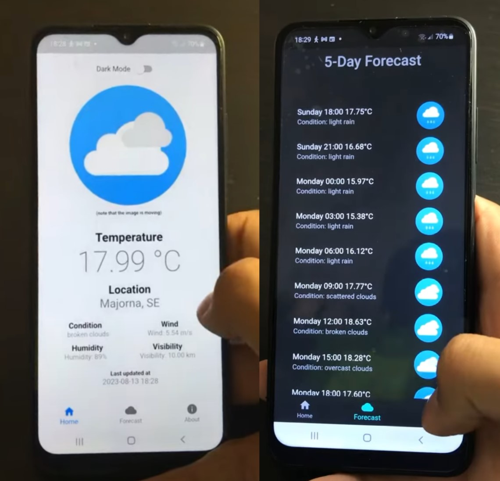

# Weather App  ☔⛅

This Weather App was developed using the <em>Flutter</em> framework as part of the course <em>Introduction to App Development 1DV535</em>, summer 2023. The app provides current weather information and a 5-day weather forecast based on the user's location. The app uses the <em>OpenWeatherMap API</em> to fetch weather data.

## Features
- **Current Weather**: Displays information like temperature, weather conditions, wind, humidity, visibility and a suitible gif icon.
- **5-Day Forecast**: Provides a detailed 5-day weather forecast.
- **About Page**: Information about the app and its developer.
- **Dark Mode**: Toggle between a dark and light theme.

## Demo

**Link**: https://www.youtube.com/watch?v=1y2JayGxYa0&list=LL&index=1
## 

